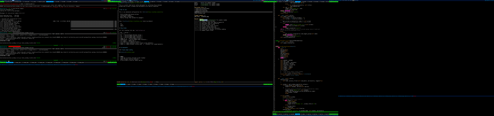
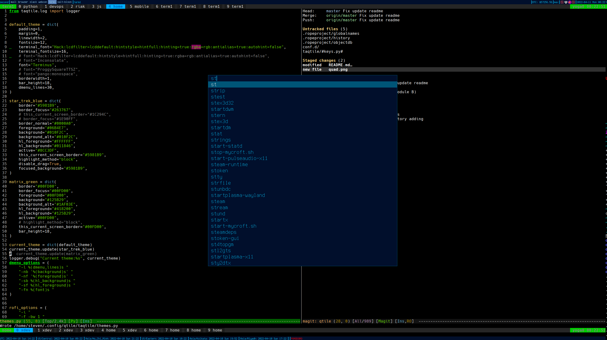
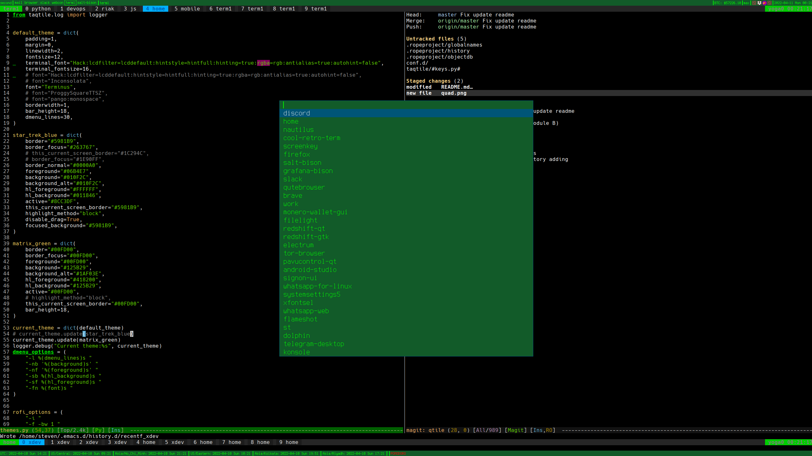

# TAQtile - Tactical Advanced Qtile Config 

Tactical Advanced Qtile Config. This is a multi head qtile config designed for switching focus between predefined screens, windows and workspaces with special keybinds. TAQtile is built on top of the highly programmable Qtile window manager written in python. 

TAQtile is the ultimate solution for advanced users looking to customize and optimize their multi-head setup. Tactical Advanced Qtile allows users to easily switch focus between predefined screens, windows and workspaces with special keybinds, improving productivity and streamlining their workflow.

TAQtile is built on top of the powerful and highly programmable Qtile window manager, written in python. This means that users can easily customize and extend their setup, creating a personalized and efficient workspace.
Whether you're a power user working with multiple monitors, or simply looking to optimize your single screen setup, TAQtile has you covered. Try it out and see the difference for yourself.

# How to use:

This is an advanced configuration for [Qtile](https://gigthub.com/qtile)

- Extra window and group actions 
- Customized widgets
- More dmenu intgration.
- Mostly things that worked for @jagguli

Uses [suckless](https://suckless.org) tools by default

- st
- surf
- dmenu

## Key binds

For full binding list see `taqtile/keys.py`

| Key  | Action  |
|:--|:--|
| F1   | Switch/Toggle Browser Group |
| F11  | Switch/Toggle Open Termial1 |
| F12  | Switch/Toggle Open Termial2 |
| Super-0..9  | Switch/Toggle Group n |
| XF86Launch5  | Switch/Toggle Open Termial3 |
| Ctrl-Space  | Dmenu Run |
| Ctrl-Meta-V | Clipboard history |
| Super-P | Dmenu password store (insert using xdotool)|
| Super-G | Dmenu browser history and `st` instance list (experimental)|

## Screenshots

### Quad head config

### Themes

**TODO**
- [DONE] highlight currently focused screen taskbar
- dmenu browser profile selector
- bring window to monitor dmenu option
